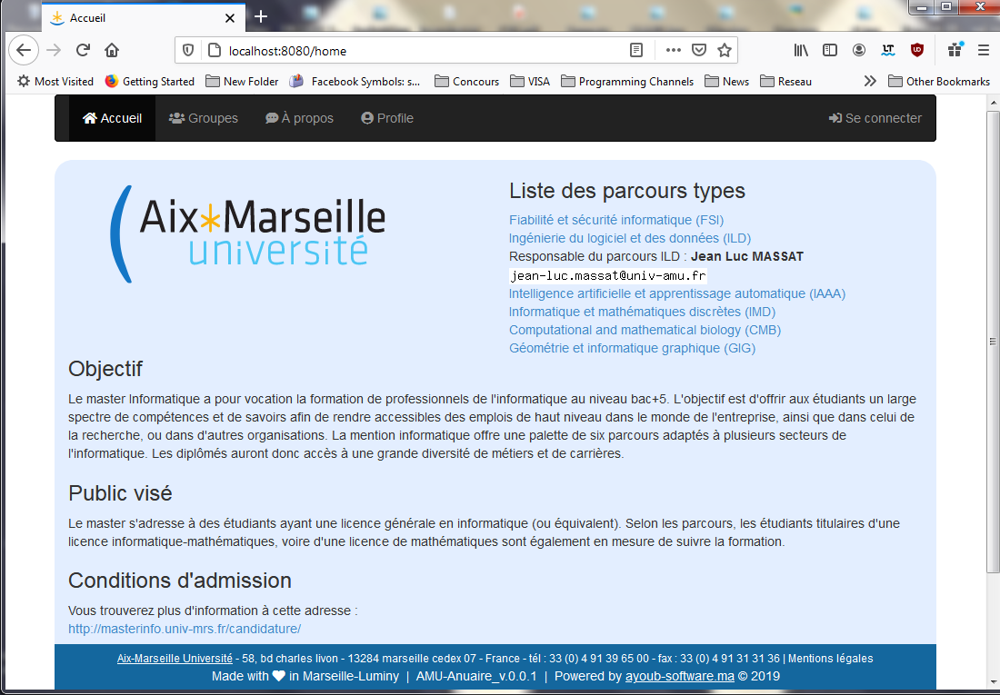
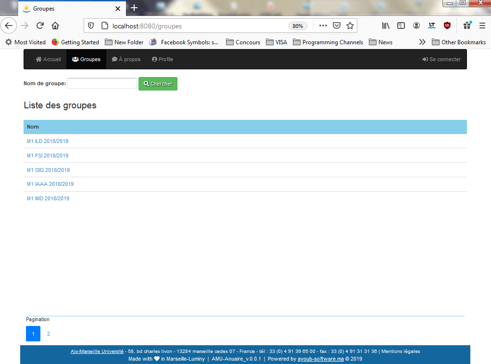
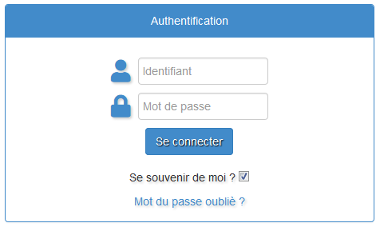
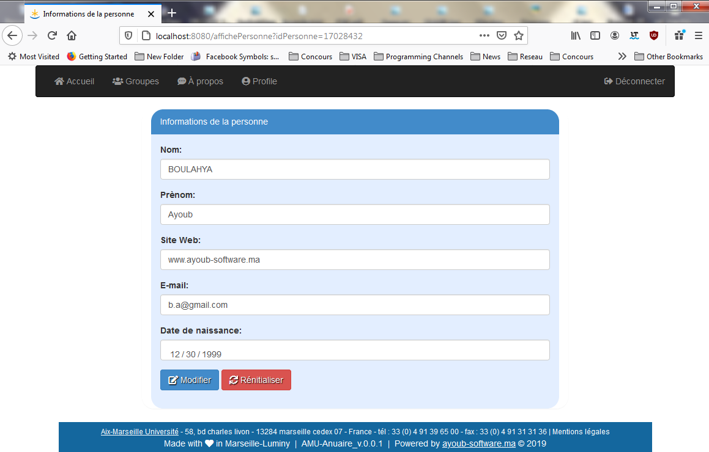

# Gestion d’annuaire des personnes
 
| Projet JEE, Master 1 Informatique |
| ------ |
| Parcours : Ingénieurie du Logiciel et des Données / Aix-Marseille Université - Luminy |
| Projet `annuaire` (v.0.0.1) |
***********************************************************************
## Features
Le  projet  de  gestion  d’annuaire  des  personnes  en  JEE  est  proposé  par  le  professeur  de l’université d’Aix Marseille Mr Jean-Luc Massat, ce projet académique, a pour but de nous évaluer dans l’unité d’enseignement de la nouvelle technologie du web « Java EE ».
 
Ce  projet  consiste  à  concevoir  et  à  réaliser  un  annuaire  de  personnes  (étudiants).  Chaque étudiant  est représenté  par  un  ensemble  d’informations  (identifiant,  nom,  prénom,  adresse électronique, site WEB, date de naissance et mot de passe) et chaque étudiant appartient à un groupe de spécialité dont le groupe est représenter aussi par un nom et un identifiant.
 
> N'hésitez pas à faire un petit tour sur le cahier des charges et le rapport du projet pour plus de détails. Veuillez les trouverez dans les deux documents PDF suivants :
 
- [Cahier des charges]
- [Rapport de projet]

### Screenshots :

#### Home

#### Listes des groupes

#### Login

#### Détails

## Tech
- SpringBoot
- Spring Security
- Spring JPA (Hibernate)
- Base de données MySQL
- ThymeLeaf
- HTML
- ✨Bootstrap✨
 
## Installation
Lancer phpMyAdmin puis lancer l'application sur Eclipse
💡 `Vous n'avez pas besoin de créer la base de données, elle va être créer automatiquement 😉`
 
## Contact
> `boulahya.ayoub@gmail.com`
 
> `ayoub.boulahya@etu.univ-amu.fr`

 
## License
**Free Software, Hell Yeah!**

[Cahier des charges]: <https://github.com/Ayoub-BL/Annuaire_AMU_JavaEE/blob/master/annuaire_documents/CdC.pdf>
[Rapport de projet]: <https://github.com/Ayoub-BL/Annuaire_AMU_JavaEE/blob/master/annuaire_documents/Rapport.pdf>
